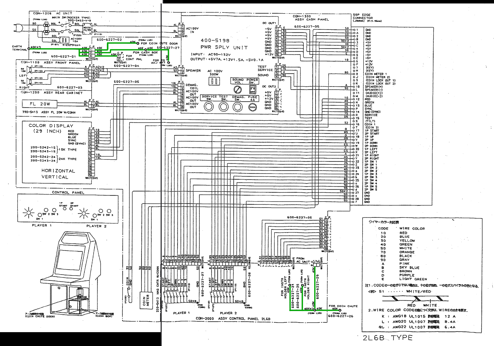
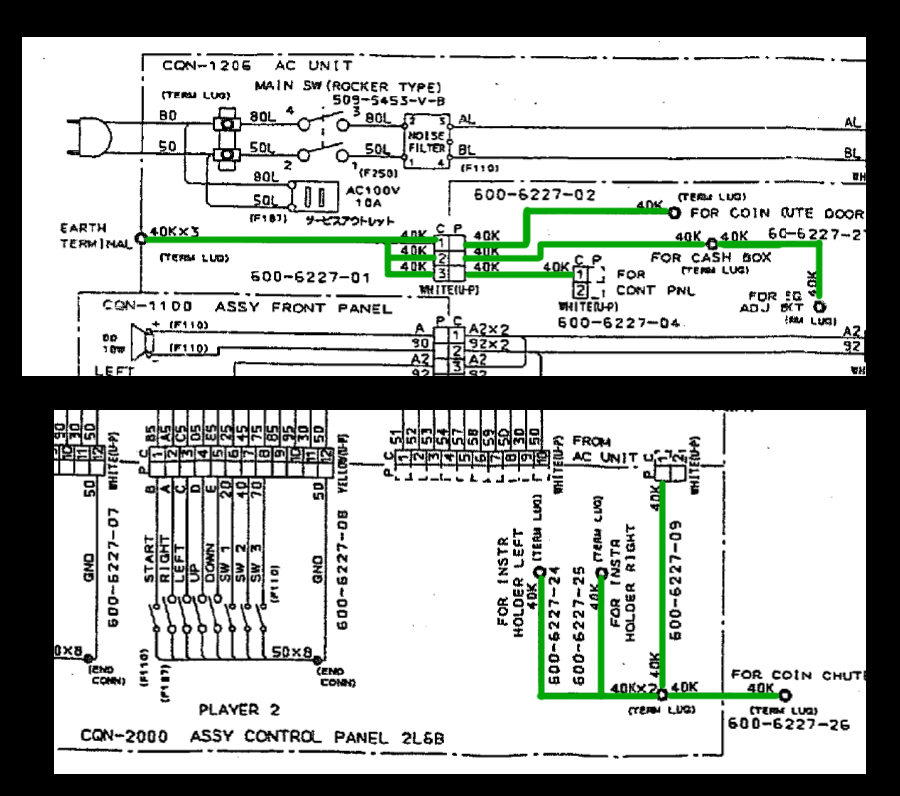

# New Astro City Ground Wiring Diagram

Simple schematic drawing of a ground wiring layout for a Sega Astro City or early model New Astro City arcade cabinet. Made in KiCAD because it was what I had available - even though there isn't really a 'PCB' associated with this schematic representation.

As of V1.1, this should be accurate to the original wiring diagrams included with the Astro City instruction manual, a copy of which is hosted on the Arcade Otaku Wiki [here.](https://wiki.arcadeotaku.com/images/0/0a/AstroCityMan.pdf)

Note that the New Astro City is slightly different, and includes an additional set of grounding connections for the Upper and Lower Control Panel Hinge. 

New Astro City models using an -01Z series PSU also have a Field Ground connection on the PSU itself that is tied into the ground wiring; models that were exported to Europe, the UK, or other 220V regions also have a transformer connection. These later New Astro City models seem to omit the 3-pin Ground connector. See page 53 of the New Astro City manual (also hosted on the Arcade Otaku Wiki) [here](https://wiki.arcadeotaku.com/images/9/96/Sega_New_Astro_City_Manual.pdf) for more details.

The different connectors shown are 2 and 3 pin AMP-UP (Universal Power) connectors.

## References / Explanation

My New Astro City uses an -01X PSU, which is apparently more common in original Astro City cabinets. So most of my conclusions are based on comparing the Astro City wiring diagram (featured in full and cropped views above, with earth ground wiring highlighted in green) with my own cabinet's wiring (which was slightly incorrect as delivered to me). I also referenced the New Astro City manual (viewable [here](https://wiki.arcadeotaku.com/images/9/96/Sega_New_Astro_City_Manual.pdf)) as a point of comparison, but it is based on a different model power supply and does not include the same inline connectors on the ground cabling.
