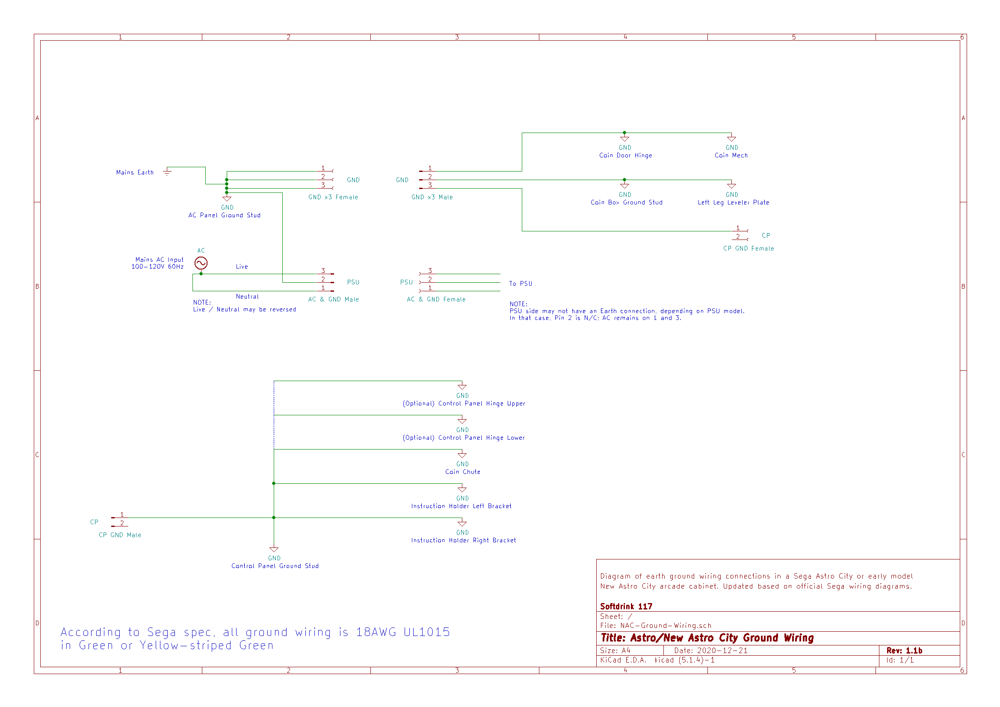

# New Astro City Ground Wiring Diagram

Simple schematic drawing of a ground wiring layout for a Sega New Astro City arcade cabinet. Made in KiCAD because it was what I had available - even though there isn't really a 'PCB' associated with this schematic representation.

I'm not entirely sure if this is the 'canonical' grounding layout as originally designed by Sega, but it seems to work well enough. This is what I'm currently using in my New Astro City cabinet.

The different connectors shown are 2 and 3 pin AMP-UP (Universal Power) connectors.
